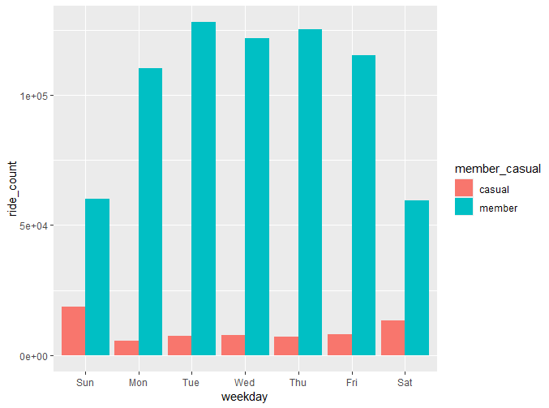
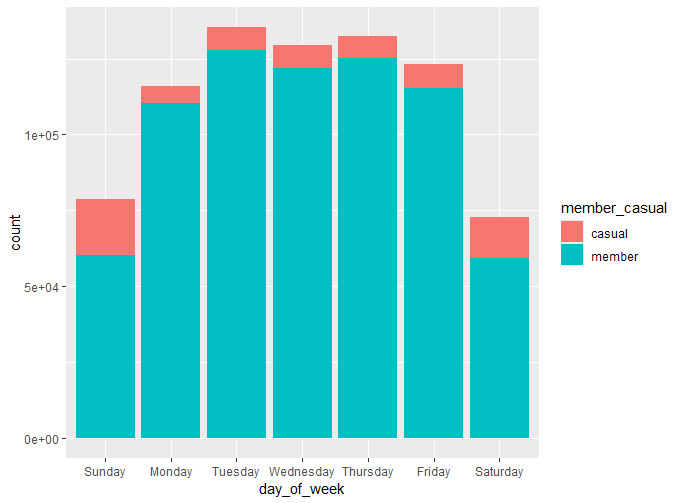
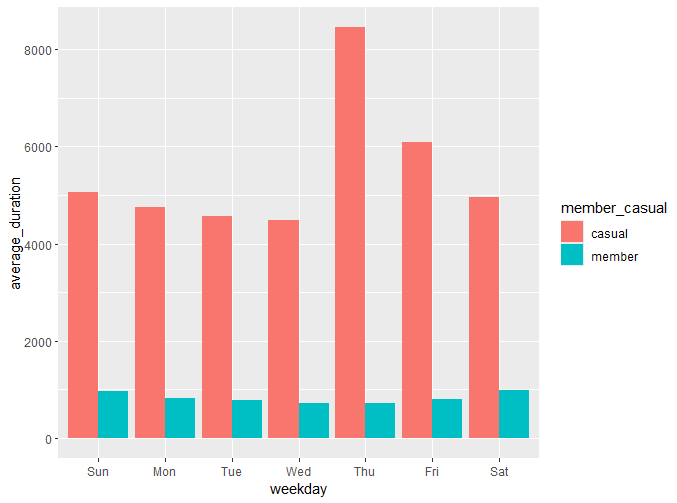

## Introduction
 For the Google Data Analytics capstone project, the student is expected to choose from a handful of data sets and perform an analysis according to a hypothetical business task. I am choosing to run an analysis on bike data for a fictional company, Cyclistic.

 **Guiding question:** How do annual members and casual riders use Cyclistic bikes differently?

This report includes the following deliverables:
1. A clear statement of the business task
2. A description of all data sources used
3. Documentation of any cleaning or manipulation of data
4. A summary of the analysis
5. Supporting visualizations and key findings
6. Top three recommendations based on your analysis

## Business Task
 
 In this case study, I will use data to answer the question of how casual riders and annual members use Cyclistic bikes differently. By answering this question, I’ll provide the marketing team with insights into how to advertise to casual riders so that they’re more likely to purchase an annual membership. Key fictional stakeholders for the business task include the Cyclistic marketing team, who are looking to increase annual memberships, and the executive team, who must approve the recommended marketing program before launch. I answer to the director of marketing, who is looking for insights in the data to inform marketing strategy.

## Data description
The data used in this project has been made available by Motivate International Inc. Data from 2019 through early 2020 is organized by quarter, while data from late 2020 through 2024 is organized by month. It is actual data for Divvy, a bike and scooter rental extension of Lyft operating in Chicago, though I’m treating it as though it belongs to the fictional company, Cyclistic. Licensing [here](https://divvybikes.com/data-license-agreement). Given that the data is provided by the Google Data Analytics case study instructions, I’m going to treat it as reliable. 

One relevant consideration is the age of the data. Though they have data up to November 2024 (at the time of writing), I have chosen to use data from the first quarter of 2019 and the first quarter of 2020. Though it would be important to use the most recent data for an actual analysis, using the older data will be sufficient for this practice case study. Additionally, this choice allows me to more closely follow along with the suggested procedures for cleaning the data, since 2019-2020 data is used in the GDA template for the case study.

## Data cleaning documentation
 I began by saving the two relevant quarters as .csv files, then loading them into R using the read_CSV function as “q1_2019” and “q1_2020.” I chose to use R for data cleaning and analysis because I’m new to it and wanted more experience. Since many of the column names changed dramatically between 2019 and 2020, I changed the column names of q1_2019 to match q1_2020 in preparation for merging the dataframes. Additionally, I changed the data type of two columns for q1_2019 to align with q1_2020. The code for these steps is as follows:
```r
# load the tidyverse and conflicted packages, then prioritize dplyr if conflicts
library(tidyverse)
library(conflicted)
conflict_prefer("filter", "dplyr")
conflict_prefer("lag", "dplyr")

# load the data for q1 of 2019 and 2020 into dataframes
q1_2019 <- read_csv("Divvy_Trips_2019_Q1.csv")
q1_2020 <- read_csv("Divvy_Trips_2020_Q1.csv")

# view the data
head(q1_2019)
colnames(q1_2019)
colnames(q1_2020)
head(select(q1_2019, usertype))
head(select(q1_2020, member_casual))

# rename q1_2019 columns to be consistent with q1_2020 columns
(q1_2019 <- rename(q1_2019
                   ,ride_id = trip_id
                   ,rideable_type = bikeid
                   ,started_at = start_time
                   ,ended_at = end_time
                   ,start_station_name = from_station_name
                   ,start_station_id = from_station_id
                   ,end_station_name = to_station_name
                   ,end_station_id = to_station_id
                   ,member_casual = usertype
))
# double check that they match
colnames(q1_2019)
colnames(q1_2020)

# check data types for inconsistencies between the tables
str(q1_2019)
str(q1_2020)

# Convert ride_id and rideable_type to character so that they can stack correctly
q1_2019 <-  mutate(q1_2019, ride_id = as.character(ride_id),rideable_type = as.character(rideable_type)) 
# check
str(q1_2019)

```
 
 Next, I merged the two dataframes, titling the new dataframe “all_trips.” Finally, I removed seven columns that either weren’t relevant to the analysis or weren’t included in both initial dataframes (latitude start/end, longitude start/end, birth year, trip duration, and gender).
```r
# Stack individual quarter's data frames into one
all_trips <- bind_rows(q1_2019, q1_2020)

# Remove lat, long, birthyear, and gender fields as this data was dropped beginning in 2020
all_trips <- all_trips %>%  
  select(-c(start_lat, start_lng, end_lat, end_lng, birthyear, gender,  "tripduration"))
```
Once I’d imported the data and combined it into a single file, I turned to clean the data for analysis. There are four values under “member_casual” when there should be two ("Subscriber", "Customer", "member",  "casual"). To fix this issue, I re-coded “subscriber” as “member” and “customer” as “casual.” Then, I copied code from the template to separate out date/time into components (day, time, day of the week) so I can more easily run calculations.
```r
# consolidate labels for "member_casual" to be consistent
all_trips <-  all_trips %>% 
  mutate(member_casual = recode(member_casual
                                ,"Subscriber" = "member"
                                ,"Customer" = "casual"))

# separate out date/time stuff so I can get ride time for everyone
all_trips$date <- as.Date(all_trips$started_at) #The default format is yyyy-mm-dd
all_trips$month <- format(as.Date(all_trips$date), "%m")
all_trips$day <- format(as.Date(all_trips$date), "%d")
all_trips$year <- format(as.Date(all_trips$date), "%Y")
all_trips$day_of_week <- format(as.Date(all_trips$date), "%A")
```

## Analysis summary
The analysis looked at ride length and ride count, comparing them between user types and between days of the week. The first step was to create a new column, ride_length, from the start and end times of trips. Next, this new column was examined, then used to create visuals displaying various features of the data. 

First I created ride_length and found the mean and median for each rider type: 
```r
# create ride length for all rows from difference in times
all_trips$ride_length <- difftime(all_trips$ended_at,all_trips$started_at)

# Convert "ride_length" from Factor to numeric so we can run calculations on the data
is.factor(all_trips$ride_length)
all_trips$ride_length <- as.numeric(as.character(all_trips$ride_length))
is.numeric(all_trips$ride_length)

# drop bad rows
all_trips_v2 <- all_trips[!(all_trips$start_station_name == "HQ QR" | all_trips$ride_length<0)]

# ride length for each member type
all_trips_casual <- all_trips_v2 %>% filter(member_casual == "casual")
all_trips_member <- all_trips_v2 %>% filter(member_casual == "member")
mean(all_trips_member$ride_length)
mean(all_trips_casual$ride_length)
median(all_trips_member$ride_length)
median(all_trips_casual$ride_length)
```
Next, I created visualizations displaying the relationship between variables in the data set, looking for trends and differences between user types. 

**Visualization One: Ride Count by User Type**


This graph is produced by following the steps in the template and shows weekday/member type vs. number of rides. The blue represents members while the red represents casual users. The code to generate the graph is as follows:


```r
all_trips_v2 %>% 
  mutate(weekday = wday(started_at, label = TRUE)) %>% 
  group_by(member_casual, weekday) %>% 
  summarise(ride_count = n()) %>% 
  arrange(member_casual, weekday)  %>% 
  ggplot(aes(x = weekday, y = ride_count, fill = member_casual)) +
  geom_col(position = "dodge")
```


**Visualization Two: Ride Count by User Type (alternative visualization)**


This graph displays the same data as the previous one, except it uses fill rather than separate bars to indicate member type. The height of the bars indicates the total count of rides for each day. Code: 
```r
# ride count vs. day of the week
all_trips_v2$day_of_week <- ordered(all_trips_v2$day_of_week, levels=c("Sunday", "Monday", "Tuesday", "Wednesday", "Thursday", "Friday", "Saturday"))
ggplot(data = all_trips_v2) + geom_bar(mapping = aes(x = day_of_week, fill = member_casual))
```

**Visualization Three: Average Ride Duration by User Type**

The x-axis of this visualization shows day of the week, the y-axis shows duration, separated by user type. Code: 
```r
all_trips_v2 %>% 
  mutate(weekday = wday(started_at, label = TRUE)) %>% 
  group_by(member_casual, weekday) %>% 
  summarise(number_of_rides = n()
            ,average_duration = mean(ride_length)) %>% 
  arrange(member_casual, weekday)  %>% 
  ggplot(aes(x = weekday, y = average_duration, fill = member_casual)) +
  geom_col(position = "dodge")
```
## Key Findings
A few observations stand out from the analysis. The first is that there are significantly more rides by members than daily users during the data period examined. The second is that members take, on average, significantly shorter rides than casual users, around 90 minutes for casual users and 13 minutes for members. While the difference between the medians in ride length is not quite so striking, it is still nearly triple for casual users (23 minutes for casual, 8 ½ minutes for members). Members take more rides but keep them shorter.

A third observation is that members' usage appears to increase during weekdays, whereas casual usage tends higher on the weekends: casual usage drops by over half from Sunday to Monday, whereas members’ usage increases noticeably from Sunday to Monday. A clear explanation for this observation is that members are more likely to use the bikes for commuting to work, whereas non-members are more likely to use the bikes for recreation. This hypothesis fits the data, assuming 1) recreational rides generally take longer than workplace commutes, and 2) weekdays are workdays, while weekends are not. 

## Recommendations
Given these observations, I can tentatively present three recommendations for how to convert casual users to annual members. The first recommendation is advertising the bikes as a means of commuting to the workplace. The data suggests they are already used for this purpose by many members. I imagine it is far more economical to have a membership for commuting users, so conversion would be a natural consequence of adopting this purpose. The second is to emphasize the convenience of a membership for short rides that one might otherwise walk. I imagine casual users are financially incentivized to take longer rides. Advertising the short ride as a convenience of an annual membership would likely appeal to casual users who hadn’t thought it through. The third recommendation is to advertise on monday, when casual users aren’t even thinking about biking (per the data): hit them when they least expect, and BAM, they’ll be biking more and more, embracing the perks of an annual membership.
	          
Good luck! ‘O=O”  ← (BIKE)


